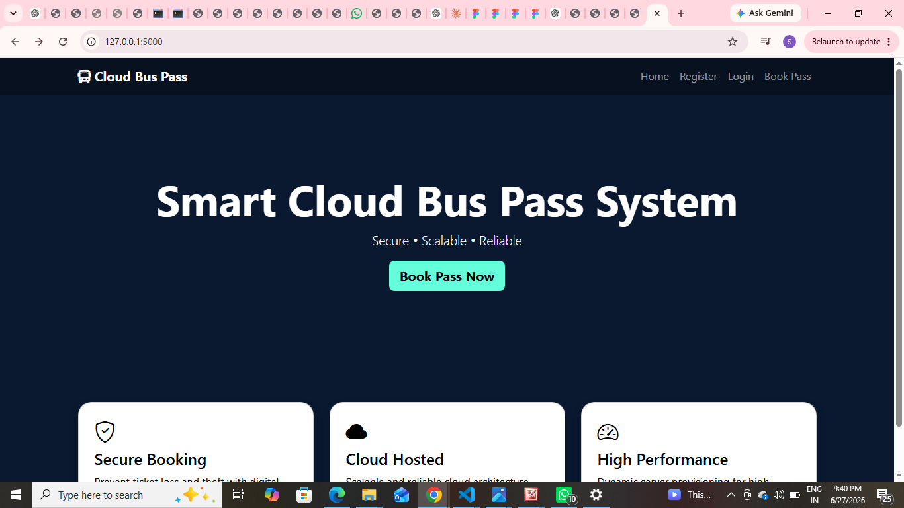
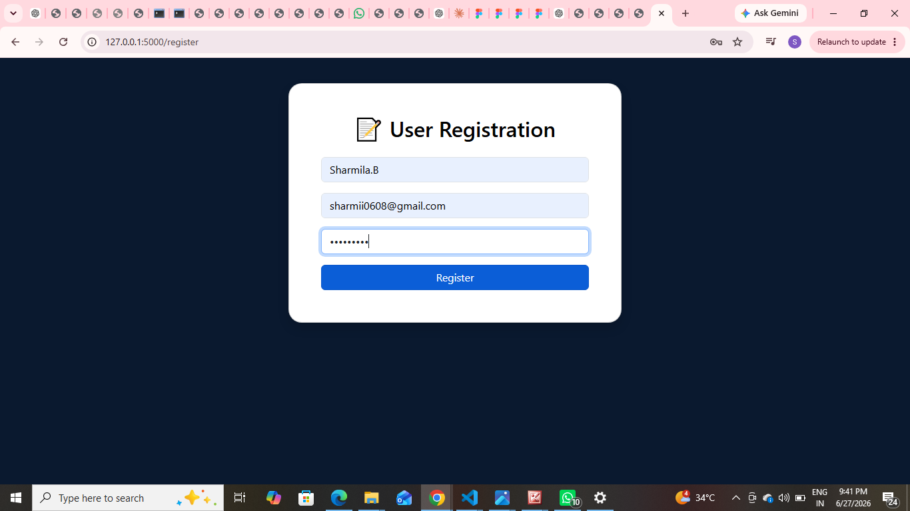
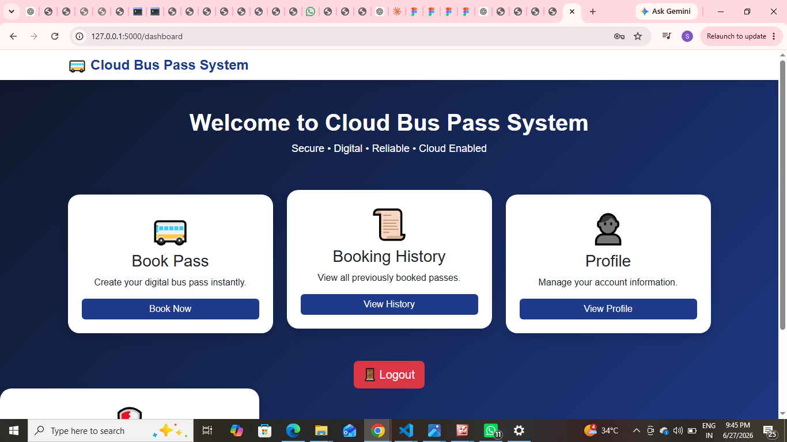
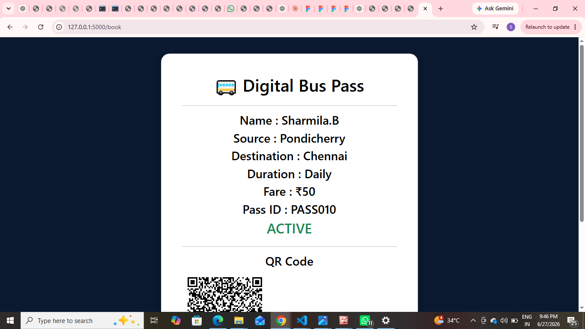
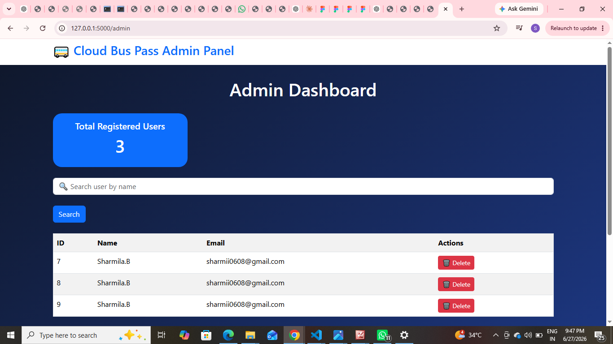

# 🚌 Smart Cloud Bus Pass System

## 📌 Overview

The **Smart Cloud Bus Pass System** is a web-based application developed using **Python Flask** that simplifies the process of applying for and managing bus passes. It provides a secure platform for users to register, log in, book bus passes, and view their pass details, while allowing administrators to manage registered users efficiently.

---

## ✨ Features

### 👤 User Module

* User Registration
* Secure User Login
* Dashboard
* Book Bus Pass
* Generate Unique Pass ID
* QR Code Generation
* View Booking History
* User Profile
* Logout

### 👨‍💼 Admin Module

* Admin Dashboard
* View Registered Users
* Search Users
* Delete Users
* View Total Registered Users

---

## 🛠️ Technologies Used

* **Backend:** Python, Flask
* **Frontend:** HTML5, CSS3, Bootstrap
* **Database:** SQLite
* **Programming Language:** Python

---

## 📂 Project Structure

```
Smart-Cloud-Bus-Pass-System
│
├── app.py
├── database.db
├── static/
│   ├── style.css
│   ├── images
│   └── QR code images
│
├── templates/
│   ├── index.html
│   ├── register.html
│   ├── login.html
│   ├── dashboard.html
│   ├── book.html
│   ├── pass.html
│   ├── history.html
│   ├── profile.html
│   ├── admin.html
│   ├── success.html
│   └── error.html
│
└── README.md
```

---

## 🚀 How to Run the Project

1. Clone the repository:

   ```
   git clone https://github.com/your-username/Smart-Cloud-Bus-Pass-System.git
   ```

2. Navigate to the project folder:

   ```
   cd Smart-Cloud-Bus-Pass-System
   ```

3. Install the required packages:

   ```
   pip install -r requirements.txt
   ```

4. Run the Flask application:

   ```
   python app.py
   ```

5. Open your browser and visit:

   ```
   http://127.0.0.1:5000
   ```

---

## 🎯 Project Objectives

* Digitalize the bus pass application process.
* Reduce manual paperwork.
* Provide secure authentication for users.
* Simplify bus pass management.
* Enable administrators to efficiently manage user records.

---

## 📸 Project Screens

## 📸 Project Screenshots

### 🏠 Home Page


### ✅ Registration Successful


### 📊 Dashboard


### 🚌 Smart Bus Pass


### 👨‍💼 Admin Dashboard


---

## 👩‍💻 Developed By

**Sharmila**

### Internship Project

Developed as part of the **CodeAlpha Internship Program**.
